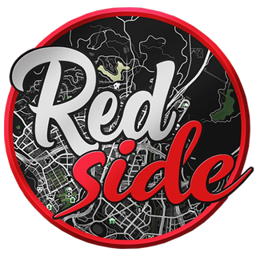

<div align="center">

<picture>
  <source media="(prefers-color-scheme: dark)" srcset="https://capsule-render.vercel.app/api?type=waving&color=0:0d1117,100:1f6feb&height=180&section=header&text=Kipstz&fontColor=ffffff&fontSize=70&fontAlignY=35&animation=fadeIn" />
  <source media="(prefers-color-scheme: light)" srcset="https://capsule-render.vercel.app/api?type=waving&color=0:1f6feb,100:58a6ff&height=180&section=header&text=Kipstz&fontColor=ffffff&fontSize=70&fontAlignY=35&animation=fadeIn" />
  
</picture>

<a href="https://github.com/Kipstz">
  
</a>

<br/>


<br/>
<br/>


</div>

---

## <samp>// about</samp>

```ts
const kipstz = {
  role: "Founder & Fullstack Developer",
  company: "Basix Agency",
  ships: "full-stack products, first pixel to last migration",
  industries: ["gaming", "tourism / events", "web"],
  alsoInto: ["reverse engineering", "game dev (s&box)", "FiveM roleplay"],
  philosophy: "ship things that matter",
};
```

I run [Basix Agency](https://basix.agency/) and build most of what ships under it myself — front end to database, first pixel to final schema. No half-finished side projects collecting dust: I take platforms from an empty repo to something real users open, click through and come back to.

<br/>

## <samp>// stats</samp>

<div align="center">

<picture>
  <source media="(prefers-color-scheme: dark)" srcset="https://github-readme-stats.vercel.app/api?username=Kipstz&show_icons=true&count_private=true&hide=contribs&hide_border=true&theme=transparent&bg_color=00000000&title_color=58A6FF&icon_color=1F6FEB&text_color=C9D1D9&ring_color=238636&card_width=420" />
  <source media="(prefers-color-scheme: light)" srcset="https://github-readme-stats.vercel.app/api?username=Kipstz&show_icons=true&count_private=true&hide=contribs&hide_border=true&theme=transparent&bg_color=ffffff00&title_color=1F6FEB&icon_color=1F6FEB&text_color=24292F&ring_color=238636&card_width=420" />
  
</picture>

</div>

---

## <samp>// featured</samp>

<table width="100%">
  <tr>
    <td align="center">
      <a href="https://basix.agency/">
        <picture>
          <source media="(prefers-color-scheme: dark)" srcset="https://capsule-render.vercel.app/api?type=rect&color=0:0d1117,100:1f6feb&height=110&section=header&text=Basix%20Agency&fontColor=ffffff&fontSize=42&fontAlignY=55&desc=we%20build%20and%20ship%20the%20web&descAlignY=82&descSize=16" />
          <source media="(prefers-color-scheme: light)" srcset="https://capsule-render.vercel.app/api?type=rect&color=0:1f6feb,100:58a6ff&height=110&section=header&text=Basix%20Agency&fontColor=ffffff&fontSize=42&fontAlignY=55&desc=we%20build%20and%20ship%20the%20web&descAlignY=82&descSize=16" />
          
        </picture>
      </a>
      <p><b>A web agency that ships custom websites and SaaS for clients — plus ready-to-go automated services like Discord bots and workflow automation.</b></p>
      <p>
        
        
        
        
      </p>
      <p>
        <a href="https://basix.agency/"></a>
      </p>
    </td>
  </tr>
</table>

---

## <samp>// built at basix</samp>

<sub>Selected work shipped under the agency.</sub>

<table>
  <tr>
    <td valign="top" width="50%">
      <h3><a href="https://legenddrop.com/">LegendDrop</a> </h3>
      <p><b>Online case opening platform.</b><br/>Open cases, win items, trade and withdraw — a full-featured case opening experience built from the ground up.</p>
      <p>
        
        
        
        
        
      </p>
      <p>
        <a href="https://legenddrop.com/"></a>
        <a href="https://github.com/LegendDrop"></a>
      </p>
    </td>
    <td valign="top" width="50%">
      <table><tr>
        <td width="56"></td>
        <td><h3><a href="https://startxperience.eu/">StartXperience</a> </h3></td>
      </tr></table>
      <p><b>Tourism SaaS for Malta.</b><br/>Helps tourists discover the best restaurants, nightclubs, parties and events across Malta — all in one place.</p>
      <p>
        
        
        
        
        
        
      </p>
      <p>
        <a href="https://startxperience.eu/"></a>
        <a href="https://github.com/StartXperience"></a>
      </p>
    </td>
  </tr>
  <tr>
    <td valign="top" width="50%">
      <table><tr>
        <td width="56"></td>
        <td><h3><a href="https://buyxperience.com/">BuyXperience</a> </h3></td>
      </tr></table>
      <p><b>Ticketing &amp; reservations for events.</b><br/>Platform for organizers and businesses to sell tickets and manage reservations.</p>
      <p>
        
        
        
        
      </p>
      <p>
        <a href="https://buyxperience.com/"></a>
      </p>
    </td>
    <td valign="top" width="50%">
      <h3>S&amp;E Studios </h3>
      <p><b>Game studio.</b><br/>Building games on s&amp;box — Facepunch's Source 2 platform — with gameplay, systems and UI written in C#.</p>
      <p>
        
        
        
      </p>
    </td>
  </tr>
</table>

---

## <samp>// fivem servers</samp>

<sub>GTA V / FiveM roleplay servers I develop.</sub>

<table>
  <tr>
    <td valign="top" width="50%">
      <table><tr>
        <td width="88"></td>
        <td><h3>LSCity </h3></td>
      </tr></table>
      <p><b>FiveM roleplay server — Los Santos City.</b><br/>Roleplay server I develop, systems and gameplay built from the ground up.</p>
      <p>
        
        
        
      </p>
    </td>
    <td valign="top" width="50%">
      <table><tr>
        <td width="88"></td>
        <td><h3>RedSide </h3></td>
      </tr></table>
      <p><b>FiveM roleplay server.</b><br/>Roleplay server I develop, systems and gameplay built from the ground up.</p>
      <p>
        
        
        
      </p>
    </td>
  </tr>
</table>

---

## <samp>// reverse engineering</samp>

Beyond shipping products, I also work low-level. I reverse-engineered FiveM (the GTA V multiplayer platform) internals — memory, game structures and runtime hooking — and built **Avenger**, a FiveM cheat, on top of that research.

<p>
  
  
  
  
</p>

---

## <samp>// stack</samp>

<div align="center">


<br/>

<br/>


</div>

<br/>

<div align="center">

```
$ whoami → fullstack dev, agency founder, ships things
```

<picture>
  <source media="(prefers-color-scheme: dark)" srcset="https://capsule-render.vercel.app/api?type=waving&color=0:1f6feb,100:0d1117&height=120&section=footer" />
  <source media="(prefers-color-scheme: light)" srcset="https://capsule-render.vercel.app/api?type=waving&color=0:58a6ff,100:1f6feb&height=120&section=footer" />
  
</picture>

</div>
